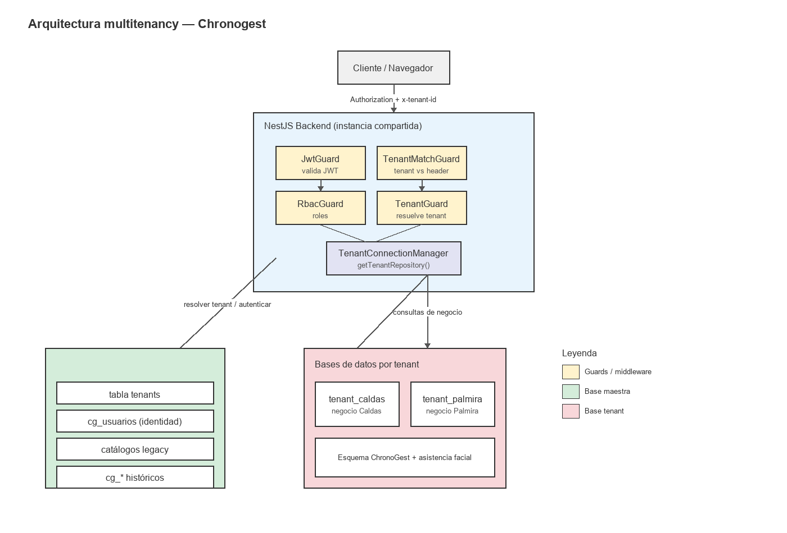

# Reporte de implementación multitenancy — Chronogest

> Fecha: 2026-06-29  
> Proyecto: `Chronogest-2.1-V`  
> Ubicación: `C:\Users\anaco\OneDrive\Desktop\Nueva carpeta`

---

## 1. Resumen ejecutivo

Se implementó una arquitectura **Database-per-Tenant** para el backend de Chronogest. Cada sede (tenant) tiene su propia base de datos física de PostgreSQL. El backend es una única instancia compartida que resuelve la conexión al tenant correspondiente mediante el header `x-tenant-id`.

Trabajo realizado en este ciclo:

- Corrección urgente de `synchronize` (maestro y dinámico).
- Replicación del esquema de asistencia facial en `tenant_palmira`.
- Implementación del `TenantMatchGuard` global para aislamiento explícito (403 en acceso cruzado).
- Verificación del flujo de super admin (`scope: platform`).
- Migración de servicios de negocio de ChronoGest a `TenantConnectionManager`.
- Backup de `sena_db` y migración de datos históricos de `sena_db` a `tenant_caldas` y `tenant_palmira`.
- Corrección de seguridad en `FichasController` (`findAll` ya no es público).
- Generación de diagrama de arquitectura (PNG/SVG) y este reporte.

---

## 2. Arquitectura general

### 2.1 Diagrama de arquitectura



> Versión vectorial: [`diagrama_arquitectura.svg`](diagrama_arquitectura.svg)

### 2.2 Bases de datos

| Base de datos | Rol | Estado |
|---|---|---|
| `sena_db` | Control / identidad / catálogos centrales | Activa. Contiene `cg_usuarios`, tabla maestra `tenants`, catálogos legacy y tablas `cg_*` históricas aún no truncadas. |
| `tenant_caldas` | Negocio de Caldas | Activa. Esquema ChronoGest + asistencia facial replicado. |
| `tenant_palmira` | Negocio de Palmira | Activa. Esquema ChronoGest + asistencia facial replicado. |

### 2.3 Catálogo de tenants (`sena_db.tenants`)

| slug | nombre | db_name | activo |
|---|---|---|---|
| `caldas` | Centro de Formación Caldas | `tenant_caldas` | true |
| `palmira` | Centro de Formación Palmira | `tenant_palmira` | true |

### 2.4 Flujo de una petición autenticada

```
Cliente ──► /api/xxx  (con Authorization + x-tenant-id)
    │
    ├─ JwtGuard        → valida JWT y carga req.user
    ├─ TenantMatchGuard→ comprueba req.user.tenantSlug == x-tenant-id
    ├─ RbacGuard       → comprueba @Roles si existe
    ├─ TenantGuard     → valida tenant y lo guarda en AsyncLocalStorage
    │
    └─ Servicio        → usa TenantConnectionManager.getTenantRepository(tenantId, Entidad)
```

Exclusiones globales de validación de tenant:
- `GET /api/tenants`
- `POST /api/super-admin/auth/login`
- cualquier ruta `/api/super-admin/*` para usuarios con `scope === 'platform'`

---

## 3. Estado de la base de datos

### 3.1 `sena_db` (maestro)

| Tabla | Count | Observación |
|---|---|---|
| `tenants` | 2 | Catálogo de sedes. |
| `cg_usuarios` | 22 | Identidad central. Campo `tenant_slug` asigna sede. |
| `cg_fichas` | 2 | Datos históricos aún no truncados. |
| `cg_ambientes` | 5 | Datos históricos aún no truncados. |
| `cg_horarios` | 11 | Datos históricos aún no truncados. |
| `cg_competencias` | 1 | Datos históricos aún no truncados. |
| `cg_instructores` | 6 | Datos históricos aún no truncados. |
| `cg_aprendices` | 3 | Datos históricos aún no truncados. |
| `cg_administradores` | 6 | Datos históricos aún no truncados. |

También existen tablas legacy de asistencia facial (`asistencia_*`, `formacion_asistencia_*`, `configuracion_asistencia_*`) pendientes de decisión.

### 3.2 `tenant_caldas`

| Tabla | Count | Origen |
|---|---|---|
| `cg_fichas` | 3 | 1 de prueba + 2 migradas de `sena_db` |
| `cg_ambientes` | 3 | 1 de prueba + 2 migrados de `sena_db` |
| `cg_horarios` | 12 | 1 de prueba + 11 migrados de `sena_db` |
| `cg_competencias` | 1 | Migrado de `sena_db` |
| `cg_instructores` | 5 | 1 de prueba + 4 migrados de `sena_db` |
| `cg_aprendices` | 4 | 1 de prueba + 3 migrados de `sena_db` |
| `cg_administradores` | 3 | 1 de prueba + 2 migrados de `sena_db` |
| `cg_configuracion` | 1 | Creado por `ConfiguracionService.find()` |
| `asistencia_sesiones` | 1 | Prueba e2e asistencia facial |
| `asistencia_registros` | 1 | Prueba e2e asistencia facial |

### 3.3 `tenant_palmira`

| Tabla | Count | Origen |
|---|---|---|
| `cg_fichas` | 1 | De prueba (`PALM123`) |
| `cg_ambientes` | 1 | De prueba |
| `cg_horarios` | 1 | De prueba |
| `cg_competencias` | 0 | — |
| `cg_instructores` | 2 | 1 de prueba + 1 migrado de `sena_db` |
| `cg_aprendices` | 1 | De prueba |
| `cg_administradores` | 5 | 1 de prueba + 4 migrados de `sena_db` |
| `cg_configuracion` | 1 | Creado por `ConfiguracionService.find()` |
| `asistencia_sesiones` | 1 | Prueba e2e asistencia facial |
| `asistencia_registros` | 1 | Prueba e2e asistencia facial |

### 3.4 Backup

- Archivo: `backups/sena_db_backup_2026-06-24.sql`
- Tamaño: ~0.19 MB
- Contiene volcado completo de `sena_db` antes de la migración de datos históricos.

### 3.5 Esquema de datos simplificado

```text
sena_db
├── tenants (id, slug, nombre, db_name, ...)
├── cg_usuarios (id, correo, documento, password, rol, tenant_slug)
├── cg_* (fichas, ambientes, horarios, instructores, aprendices, administradores, ...)
│   └── datos históricos; ya migrados a tenants
└── tablas legacy (acceso, credencial, rol, persona, ...)
    └── permanecen centralizadas

tenant_caldas / tenant_palmira
├── cg_fichas
├── cg_ambientes
├── cg_horarios
├── cg_instructores
├── cg_aprendices
├── cg_administradores
├── cg_competencias
├── cg_eventos
├── cg_solicitudes_cambio
├── cg_notificaciones
├── cg_ubicaciones
├── cg_configuracion
├── asistencia_sesiones
├── asistencia_registros
├── asistencia_orm_entity
└── formacion_asistencia_orm_entity
```

---
## 4. Backend: migración a multitenancy

### 4.1 `TenantConnectionManager`

Ubicación: `Asistencia-Backend/src/infrastructure/persistence/tenants/tenant-connection.manager.ts`

Responsabilidades:
- Resolver el registro del tenant desde `sena_db.tenants`.
- Crear y cachear `DataSource` de TypeORM por tenant (LRU).
- Proveer `getTenantRepository(tenantId, Entity)`.
- **No ejecuta `synchronize` ni `migrationsRun`** en la conexión lazy; el esquema se aplica una sola vez al crear el tenant.

Entidades de negocio registradas (`TENANT_BUSINESS_ENTITIES`):

```ts
Ficha, AmbienteCG, InstructorCG, AprendizCG, AdminCG, HorarioCG,
Competencia, Evento, SolicitudCambio, Notificacion, ConfiguracionApp, Ubicacion,
AsistenciaRegistroTenantEntity, AsistenciaSesionTenantEntity,
AsistenciaTenantEntity, FormacionAsistenciaTenantEntity
```

### 4.2 Provisionamiento de tenants

- `TenantProvisioningService`: crea base de datos física, inserta en `sena_db.tenants`, ejecuta migraciones.
- `TenantMigrationRunner`: aplica migraciones de `src/migrations/tenant/*.ts` una sola vez con `synchronize: false`.

### 4.3 Servicios migrados a tenant (usando `TenantConnectionManager`)

| Servicio | Entidades tenant | Notas |
|---|---|---|
| `HorariosAdminService` | Ficha, AmbienteCG, InstructorCG, AprendizCG, AdminCG, HorarioCG, Competencia, Evento, SolicitudCambio, Notificacion, ConfiguracionApp | CRUD completo del módulo admin de horarios |
| `InstructoresService` | InstructorCG | Enriquece con `UsuarioCG` maestro para mostrar sede |
| `AdministradoresService` | AdminCG | Enriquece con `UsuarioCG` maestro para mostrar sede |
| `FichasService` | Ficha | — |
| `AmbientesService` | AmbienteCG | — |
| `HorariosService` | HorarioCG | — |
| `CompetenciasService` | Competencia, HorarioCG | Usa HorarioCG para `findByInstructor` |
| `EventosService` | Evento | — |
| `SolicitudesService` | SolicitudCambio | — |
| `NotificacionesService` | Notificacion | — |
| `ConfiguracionService` | ConfiguracionApp | Crea fila por defecto si no existe |
| `UbicacionesService` | Ubicacion | Usa `createQueryBuilder` del repo tenant |
| `AprendicesService` | AprendizCG | Enriquece con `UsuarioCG` maestro |
| `AsistenciaSesionService` | AsistenciaSesionTenantEntity, etc. | Ya usaba tenant desde antes |
| `AsistenciaRegistroService` | AsistenciaRegistroTenantEntity, etc. | Ya usaba tenant desde antes |
| `AuthCGService` | InstructorCG, AprendizCG, AdminCG, ConfiguracionApp | Perfiles en tenant; identidad en maestro |

### 4.4 Servicios que permanecen en `sena_db` (maestros)

| Servicio | Entidades maestras | Razón |
|---|---|---|
| `SuperAdminAuthService` | `UsuarioCG` | Identidad de plataforma (`scope: platform`) |
| `UsuariosCGService` | `UsuarioCG` | Gestión de sede del usuario; valida tenant con `resolveTenant()` |
| `AuthService` / `AuthTypeOrmRepository` | Credencial, Acceso, Rol, Persona | Sistema legacy de autenticación centralizado |
| `FormativoService` | CentroFormacion, Sede, Departamento, Municipio, Area, Programa, Persona, Curso, Matricula, Aplicativo, Modulo, Servicio, Usuario, Credencial, Permiso, Acceso, Rol, Ambiente | CRUD de catálogos globales/legacy |
| Módulos legacy (`departamento`, `municipio`, `centro-formacion`, `sede`, `ambiente`, `area`, `programa`, `curso`, `matricula`, `persona`, `aplicativo`, `modulo`, `servicio`, `rol`, `permiso`, `usuario`, `credencial`, `acceso`, `horario`) | Sus respectivas `*OrmEntity` | Catálogos centrales según decisión arquitectónica |

### 4.5 Super admin

- Login: `POST /api/super-admin/auth/login` (ahora `@Public()`).
- JWT incluye `scope: "platform"`.
- `TenantMatchGuard` excluye `/super-admin/*` y permite `scope === 'platform'`.
- Endpoint probado: `GET /api/super-admin/tenants` → 200.

Usuario de prueba creado:
- `superadmin@platform.com` / `999999999` / `admin123`

---

## 5. Seguridad

### 5.1 Guards globales (orden en `app.module.ts`)

```ts
{ provide: APP_GUARD, useClass: JwtGuard       },
{ provide: APP_GUARD, useClass: TenantMatchGuard },
{ provide: APP_GUARD, useClass: RbacGuard      },
{ provide: APP_GUARD, useClass: TenantGuard    },
```

### 5.2 Diagrama de secuencia — validación de una petición

```text
Cliente
  │ POST /api/horarios-admin/fichas
  │ Authorization: Bearer <token Caldas>
  │ x-tenant-id: palmira
  ▼
JwtGuard ──► decodifica JWT ──► req.user = { tenantSlug: 'caldas', ... }
  │
  ▼
TenantMatchGuard ──► req.user.tenantSlug !== x-tenant-id
  │                    │
  │                    ▼
  │              throw ForbiddenException('Acceso no autorizado a este tenant')
  │                    │
  ▼                    ▼
Cliente ◄── HTTP 403
```

### 5.3 Lógica de `TenantMatchGuard`

```ts
if (ruta empieza con /super-admin) return true;
if (!req.user) return true;        // endpoint público
if (req.user.scope === 'platform') return true;
if (!x-tenant-id) return true;
if (req.user.tenantSlug !== x-tenant-id) throw 403;
return true;
```

### 5.4 Corrección de seguridad

`FichasController.findAll()` tenía `@Public()`, lo que permitía leer fichas de cualquier sede solo cambiando el header `x-tenant-id`. Se eliminó `@Public()`; ahora el endpoint requiere autenticación y `TenantMatchGuard` bloquea accesos cruzados.

---

## 6. Migración de datos históricos

### 6.1 Criterio de separación (Opción A)

1. **Perfiles de usuario** (`cg_instructores`, `cg_aprendices`, `cg_administradores`): asignar tenant según `cg_usuarios.tenant_slug` por `documento`.
2. **Fichas**: asignar al tenant con mayoría de aprendices relacionados. Si no hay aprendices, por mayoría de instructores en horarios. Si aún no se puede determinar, default `caldas`.
3. **Horarios**: asignar según la ficha a la que pertenecen.
4. **Ambientes**: asignar según mayor uso en horarios de cada tenant.
5. **Competencias**: asignar según el horario al que pertenecen.

### 6.2 Resultado de la migración

| Recurso | Caldas | Palmira | Sin asignar |
|---|---|---|---|
| Instructores | 4 | 1 | 1 (doc `222222`, sin usuario) |
| Aprendices | 3 | 0 | 0 |
| Administradores | 2 | 4 | 0 |
| Fichas | 2 | 0 | 0 |
| Horarios | 11 | 0 | 0 |
| Ambientes | 2 | 0 | 0 |
| Competencias | 1 | 0 | 0 |

> El instructor sin usuario (`d@d.com` / `222222`) quedó asignado a Caldas indirectamente porque sus horarios apuntan a la ficha `3063290`, que fue asignada a Caldas.

### 6.3 Scripts ejecutados

Ubicación: `backups/`

- `migrate_profiles_caldas.sql` / `migrate_profiles_palmira.sql`  
  Migran perfiles usando `dblink` desde `sena_db`.
- `migrate_catalogs_caldas.sql` / `migrate_catalogs_palmira.sql`  
  Migran catálogos usando tablas temporales y reglas de propagación.

### 6.4 Reversión

Restaurar el backup:

```bash
psql -U postgres -d sena_db < backups/sena_db_backup_2026-06-24.sql
```

Si es necesario, truncar también las tablas migradas en `tenant_caldas` y `tenant_palmira`.

---

## 7. Pruebas realizadas

### 7.1 Super admin

| Caso | Resultado |
|---|---|
| Login correcto | `200` + JWT con `scope: platform` |
| `GET /api/super-admin/tenants` | `200` con Caldas y Palmira |
| Login incorrecto | `401` |

### 7.2 Aislamiento de asistencia facial (`tenant_palmira`)

- Login aprendiz → `face-status` → `register-face` → login instructor → crear sesión → `verificar-rostro` → registrar firma.
- Registros creados en `tenant_palmira.asistencia_registros` y `asistencia_orm_entity`.
- Usuario de Caldas no puede ver sesión de Palmira → `403`.

### 7.3 Aislamiento de servicios ChronoGest

| Endpoint | Caldas | Palmira | Cross C→P |
|---|---|---|---|
| `GET /api/fichas` | 3 | 1 | 403 |
| `GET /api/ambientes` | 3 | 1 | 403 |
| `GET /api/horarios` | 12 | 1 | 403 |
| `GET /api/competencias` | 1 | 0 | 403 |
| `GET /api/instructores` | 5 | 2 | 403 |
| `GET /api/administradores` | 3 | 5 | 403 |
| `GET /api/horarios-admin/fichas` | 3 | 1 | 403 |
| `GET /api/horarios-admin/instructores` | 5 | 2 | 403 |
| `GET /api/horarios-admin/administradores` | 3 | 5 | 403 |

---

## 8. Archivos clave modificados o creados

### Backend (modificados)

- `Asistencia-Backend/src/app.module.ts`
- `Asistencia-Backend/src/auth/infrastructure/guards/tenant-match.guard.ts`
- `Asistencia-Backend/src/auth/infrastructure/guards/jwt.guard.ts`
- `Asistencia-Backend/src/super-admin/controllers/super-admin-auth.controller.ts`
- `Asistencia-Backend/src/chronogest/services/horarios-admin.service.ts`
- `Asistencia-Backend/src/chronogest/services/instructores.service.ts`
- `Asistencia-Backend/src/chronogest/services/administradores.service.ts`
- `Asistencia-Backend/src/chronogest/services/fichas.service.ts`
- `Asistencia-Backend/src/chronogest/services/ambientes.service.ts`
- `Asistencia-Backend/src/chronogest/services/horarios.service.ts`
- `Asistencia-Backend/src/chronogest/services/competencias.service.ts`
- `Asistencia-Backend/src/chronogest/services/eventos.service.ts`
- `Asistencia-Backend/src/chronogest/services/solicitudes.service.ts`
- `Asistencia-Backend/src/chronogest/services/notificaciones.service.ts`
- `Asistencia-Backend/src/chronogest/services/configuracion.service.ts`
- `Asistencia-Backend/src/chronogest/services/ubicaciones.service.ts`
- `Asistencia-Backend/src/chronogest/controllers/fichas.controller.ts`
- `Asistencia-Backend/src/infrastructure/persistence/tenants/tenant-connection.manager.ts`

### Scripts, backups y documentación (creados)

- `backups/sena_db_backup_2026-06-24.sql`
- `backups/migrate_profiles_caldas.sql`
- `backups/migrate_profiles_palmira.sql`
- `backups/migrate_catalogs_caldas.sql`
- `backups/migrate_catalogs_palmira.sql`
- `docs/REPORTE_MULTITENANCY.md`
- `docs/diagrama_arquitectura.png`
- `docs/diagrama_arquitectura.svg`
- `generate_diagram.py`
- `generate_reporte_pdf.py`

---

## 9. Pendientes y decisiones futuras

1. **¿Truncar tablas de negocio en `sena_db`?**  
   Las tablas `cg_*` históricas ya no son usadas por los servicios migrados. Con el backup disponible, se pueden truncar para dejar `sena_db` como base de control pura.

2. **Asistencia facial legacy**  
   Pendiente decisión del usuario: migrar a entidades tenant (`AsistenciaTenantEntity`, etc.) o deprecar endpoints legacy (`AsistenciaOrmEntity`, `FormacionAsistenciaOrmEntity`, `ConfiguracionAsistenciaOrmEntity`).

3. **Panel frontend de super admin (Paso 5)**  
   Aún no se ha desarrollado la interfaz en `admin.localhost:4200`.

4. **Mejorar enriquecimiento de sede**  
   `InstructoresService`, `AdministradoresService` y `AprendicesService` usan un `switch` hardcodeado para `yamborot` / `centro-comercio`. Se debería usar `connectionManager.resolveTenant()` para mostrar el nombre real de `caldas` / `palmira`.

5. **Datos sin usuario asignado**  
   En la migración de perfiles, instructores/aprendices/administradores sin usuario en `cg_usuarios` quedaron fuera de la migración automática. Ejemplo: instructor `d@d.com` / documento `222222` fue asignado a Caldas por propagación de horarios, aunque no tiene usuario maestro.

6. **Limpieza de `chronogest.module.ts`**  
   `TypeOrmModule.forFeature([...])` aún lista entidades ChronoGest para el maestro. Aunque `synchronize: false` evita que se recreen, se podría limpiar cuando se confirme que nada más usa esos repositorios maestros.

---

*Reporte generado automáticamente el 2026-06-29.*
